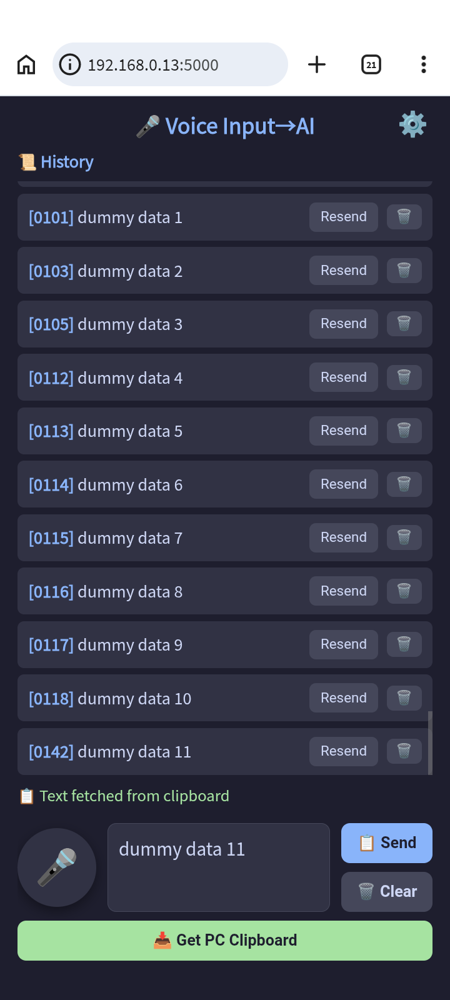
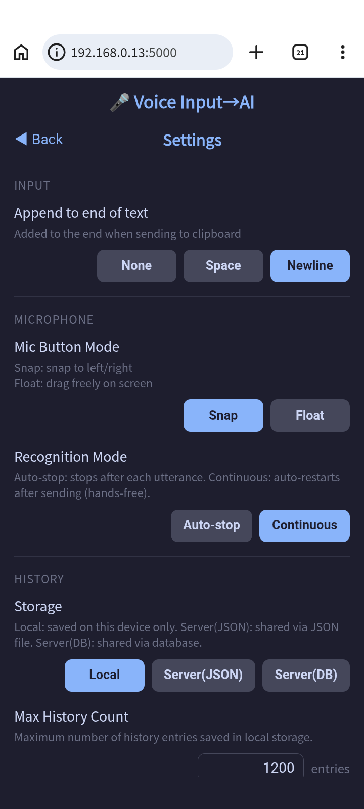

English | [日本語](README_ja.md)

# Voice Input Tool

A tool that captures voice input from your smartphone (Android/iPhone) microphone and transfers it to your PC clipboard.
Also supports fetching PC clipboard content to your smartphone.

| Main Screen | Settings Screen |
|:---:|:---:|
|  |  |

## About This App

Want to use voice input with AI right now, but your PC has no microphone?
This app solves that problem instantly.

Honestly, "Voice Input → AI" is a bit of an exaggeration.
What it actually does is "Voice Input → PC Clipboard."
But it will dramatically change how you interact with your computer.


## Supported Devices

| Device | Browser | Voice Recognition | Auto Clipboard Fetch |
|---|---|---|---|
| iPhone | Safari | ✅ | ❌ (iOS security restriction) |
| iPhone | Chrome | ✅ | ❌ (iOS security restriction) |
| Android | Chrome | ✅ | ✅ |

> **Note**: Voice recognition requires an internet connection as it uses Google's cloud service.

## How It Works

Voice-recognized text is written to the PC clipboard, so it works with **any application that supports paste (Ctrl+V)**.

- VS Code / Text editors
- Word / Excel and other Office apps
- Browser text fields
- Slack / Chat tools
- Terminal / Command line
- Any other app that can access the clipboard

## Requirements

- **Python 3.8 or higher**（[https://www.python.org/downloads/](https://www.python.org/downloads/)）

## Setup

```bash
cd voice_input
pip install -r requirements.txt
```

## Starting the Server

Start the server with the following command:

```bash
nohup python server.py > server.log 2>&1 &
```

On startup, the PC's local IP address is logged to `server.log`:

```
==================================================
  Voice Input Server Started
  Android (HTTP) : http://192.168.x.x:5000
  iPhone  (HTTPS): https://192.168.x.x:5001
==================================================
```

## Access URLs

| Device | URL |
|---|---|
| Android | `http://192.168.x.x:5000` |
| iPhone | `https://192.168.x.x:5001` (requires certificate setup, see below) |

### Access via QR Code

When the server starts, QR code image URLs are shown in the CLI.

```
  QR (Android) : http://192.168.x.x:5000/qr_android.png
  QR (iPhone)  : http://192.168.x.x:5000/qr_ios.png
```

Open the URL in a PC browser and scan the QR code with your smartphone camera to connect.
You can also display the QR code from the "QR Code" section in the settings screen.

## Screen Layout

- **Top**: History area (oldest at top, newest at bottom)
- **Bottom**: Controls (mic, text, send/clear, PC clipboard fetch, mode switch)

## Usage

1. Start the server (run the command above)
2. Open the URL above on your smartphone (Android: Chrome / iPhone: Safari or Chrome)
3. Tap the 🎤 button and speak
4. Text is automatically sent to the PC clipboard and added to the history
5. Click the Claude Code chat field in VS Code and press `Ctrl+V` to paste

### Mic Button Position

Use the "🔄 Mode Switch" button to toggle between two modes. Settings are saved in localStorage.

| Mode | Behavior |
|---|---|
| **Snap Mode** (default) | Drag the mic button left/right to snap it to either side |
| **Floating Mode** | Drag the mic button anywhere on the screen |

### Auto Smartphone Clipboard Fetch

When you copy text in another app and switch back to the browser, the clipboard content is automatically displayed in the text area.

- Only triggers when the clipboard content has changed
- **Supported**: Android Chrome (confirmed working)

### Fetch PC Clipboard to Smartphone

Tap the "📥 Fetch PC Clipboard" button to add PC clipboard content to the history.

- **50 characters or less**: Also shown in the preview area with the send button enabled
- **51 characters or more**: Added to history only (preview unchanged)
- **Duplicate content**: No duplicate entry is created; only the sequence number is updated

### History

- Up to 1000 entries saved in browser localStorage (per device)
- Displayed oldest-first, newest at bottom; auto-scrolls on each entry
- Shown with sequence numbers (000–999)
- Resend and delete supported
- Sending the same text again removes the existing entry and re-adds it at the bottom

## Server History Storage

The server history storage location depends on the `DB_HOST` environment variable.

| `DB_HOST` | Storage |
|---|---|
| Not set (default) | `history_server.json` (local file) |
| Hostname or IP address | MySQL |

To use MySQL, set the following environment variables before starting the server:

| Variable | Default | Description |
|---|---|---|
| `DB_HOST` | (not set) | MySQL hostname or IP address |
| `DB_PORT` | `3306` | MySQL port number |
| `DB_NAME` | `voice_input` | Database name |
| `DB_USER` | `voice_input` | Username |
| `DB_PASSWORD` | `voice_input_pass` | Password |

```bash
export DB_HOST=localhost
nohup python server.py > server.log 2>&1 &
```

## Docker Setup (MySQL)

Run MySQL in a Docker container.

### Install Docker

Install [Docker Desktop](https://www.docker.com/products/docker-desktop/).

### Check That the TCP Port Is Available

Before running `docker compose up`, verify that port 3306 is not already in use.

```bash
netstat -ano | findstr :3306
```

If any output appears, another process (e.g. a local MySQL instance) is using the port. Stop it before running `docker compose up`.

### Create and Start the Container

```bash
cd voice_input
docker compose up -d
```

The image will be downloaded on first run.

### Check Status

```bash
docker compose ps
```

The server can be started once the `mysql` service shows `healthy`.

### Stop the Container

```bash
docker compose down
```

To delete data (including volumes):

```bash
docker compose down -v
```

### Start the Server in MySQL Mode

```bash
export DB_HOST=localhost
nohup python server.py > server.log 2>&1 &
```

---

## Stopping the Server

To stop manually (stops only server.py using the PID file):

```bash
pid=$(cat server.pid); kill $pid
```

---

## Initial Setup: Android

One-time setup to allow microphone access over HTTP:

1. Open `chrome://flags/#unsafely-treat-insecure-origin-as-secure` in Android Chrome
2. Enter `http://192.168.x.x:5000` (the URL shown when the server starts) in the text box
3. Tap **Relaunch** to restart Chrome

### Security Notice

**This is safe for practical use within your home's closed Wi-Fi network.**

This setting treats the specified URL as equivalent to HTTPS. Normally, HTTP cannot access sensitive APIs like the microphone.

- **Eavesdropping risk**: HTTP traffic is unencrypted, so audio text could be intercepted by others on the same Wi-Fi
- **Scope**: Limited to the specified URL (`http://192.168.x.x:5000`) only — no effect on other sites
- **Flag behavior**: `chrome://flags` are experimental features that may change with future Chrome updates

Why it's safe on home Wi-Fi:
- Traffic does not leave the router
- No untrusted devices on the network
- Use case is limited to voice text transfer (low risk if not confidential)

---

## Initial Setup: iPhone

### Generate a Certificate (on PC)

```bash
cd voice_input
openssl req -x509 -newkey rsa:2048 -keyout key.pem -out cert.pem -days 3650 -nodes -subj "//CN=192.168.x.x"
```

Replace `192.168.x.x` with your PC's IP address (shown in `server.log`).

> If your PC's IP address changes, regenerate the certificate.

### After Generating the Certificate

When `cert.pem` and `key.pem` exist in the `voice_input/` folder, the server automatically enables:

- **Port 5000 (HTTP)** → Certificate file served at `/cert` endpoint
- **Port 5001 (HTTPS)** → Accessible from iPhone

Deleting the certificate files reverts to HTTP only (port 5000).

### iOS Certificate Installation (first time only)

**Step 1: Download the Certificate**

1. Make sure your iPhone and PC are on the same Wi-Fi
2. Open **Safari or Chrome** on your iPhone
3. Navigate to:

```
http://192.168.x.x:5000/cert
```

4. Tap **Allow** when prompted to download from "192.168.x.x"
5. Tap "Open in Settings" from the top of the screen or the download icon

**Step 2: Install the Profile**

1. Open the Settings app
2. Go to Settings → General → **VPN & Device Management**
3. Tap the certificate listed under "Downloaded Profile"
4. Tap **Install** in the top right
5. Tap **Install** again on the warning screen → **Done**

**Step 3: Trust the Certificate**

1. Go to Settings → General → **About** → **Certificate Trust Settings**
2. Toggle on the installed certificate
3. Tap **Continue** on the warning dialog

You can now access `https://192.168.x.x:5001`.

---

## Using Without a Server Connection

If the smartphone cannot connect to the server, reloading the browser will fail to retrieve the app, making it unavailable.

In such cases, the app can be downloaded from the voice_input official server.
The app served from the official server runs in **Official Mode**.

In Official Mode, the following features are restricted:

1. The send button is disabled (PC clipboard paste is not available)
2. Server history saving (JSON / DB) is disabled
3. History is saved on the smartphone only

**Use it as a memo app.**

> Coming soon

---

## Notes

- PC and smartphone must be on the same Wi-Fi network
- Voice recognition requires an internet connection (uses Google's speech recognition service)
- Web Speech API works on Android Chrome, iPhone Safari, and desktop Chrome
- iPhone users should use Safari or Chrome

## Limitations

### Clipboard Restrictions by Server Environment

| Environment | Clipboard Write (`/send`) | Clipboard Read (`/clipboard`) |
|---|---|---|
| Windows (native) | ✅ Works | ✅ Works |
| WSL2 | ⚠️ Works only if `clip.exe` is in PATH | ⚠️ Works only if `powershell.exe` is in PATH |
| Docker container | ❌ Does not work | ❌ Does not work |

#### Why Docker Containers Don't Work

The server runs in an isolated Linux container and has no way to access the host OS (Windows) clipboard.

| Method | Result | Reason |
|---|---|---|
| `clip.exe` / `powershell.exe` | ❌ Unavailable | Windows CLI tools do not exist inside the container |
| `xclip` | ❌ Unavailable | No GUI display (`DISPLAY` env var) available |
| `pyperclip` | ❌ Unavailable | Depends on the above tools |

### Auto Smartphone Clipboard Fetch

| Environment | Works | Reason |
|---|---|---|
| Android Chrome | ✅ | Clipboard API supported |
| iPhone Safari | ❌ | iOS security restriction |
| iPhone Chrome | ❌ | Same as above |

#### Why It Doesn't Work on iPhone

The app uses two clipboard mechanisms:

| Feature | Mechanism | iPhone |
|---|---|---|
| 📥 Fetch PC Clipboard | Smartphone → Server (Python) → PC OS API | ✅ Works |
| Auto smartphone clipboard fetch | Browser JS → Smartphone OS | ❌ Does not work |

"Fetch PC Clipboard" works because Python accesses the PC OS directly without browser restrictions. Auto-fetching the smartphone clipboard uses JavaScript within the browser, which is subject to browser sandbox restrictions. iOS enforces strict limits — requiring user confirmation each time — making automatic fetch on app focus impossible. Android allows automatic fetch once permission is granted.

To get PC clipboard content on iPhone, use the "📥 Fetch PC Clipboard" button.
