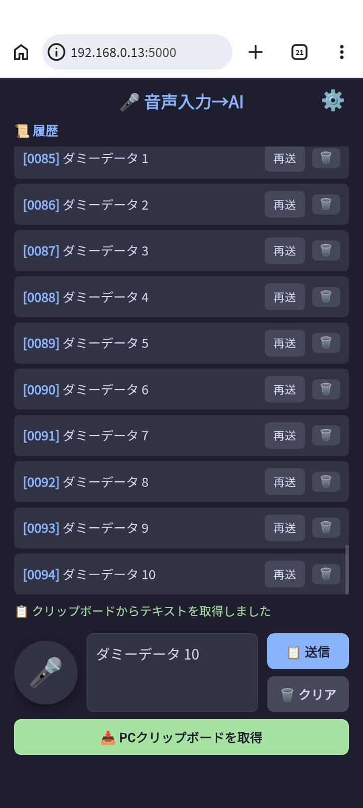
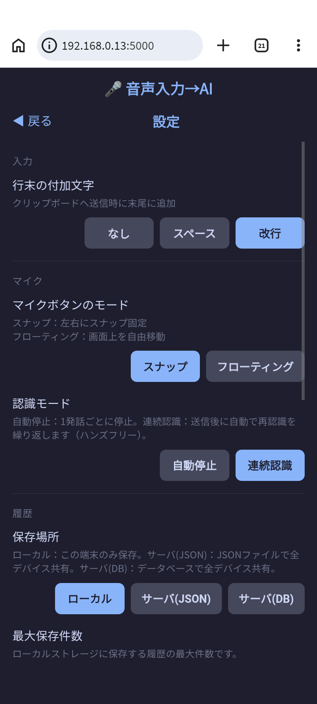

[English](README.md) | 日本語

# 音声入力ツール

スマホ（Android/iPhone）のマイクから音声入力し、PCのVS Code ClaudeCodeチャットへ転送するツール。
PCのクリップボード内容をスマホへ取得する機能も備えています。

| メイン画面 | 設定画面 |
|:---:|:---:|
|  |  |

## このアプリについて

今すぐ AI に音声入力をしたい。
でも PC にマイクが繋がっていない。
そんなあなたのお悩み、即解決します。

老若ニャンコもプログラミング、メール・・・、できます
ニャンコも・・・？
//できるか～～～～～ッ！

正直、「音声入力 → AI」は誇大表現です。
実際は、「音声入力 → PCクリップボード」です。
このアプリはあなたが体験する世界を劇的に変えます。


## 対応機種

| 端末 | ブラウザ | 音声認識 | クリップボード自動取得 |
|---|---|---|---|
| iPhone | Safari | ✅ | ❌（iOSセキュリティ制限） |
| iPhone | Chrome | ✅ | ❌（iOSセキュリティ制限） |
| Android | Chrome | ✅ | ✅ |

> **注意**: 音声認識はGoogleのクラウドサービスを使用するためインターネット接続が必要です。

## 仕組み

音声認識したテキストをPCのクリップボードに書き込む仕組みのため、**クリップボードからの貼り付け（Ctrl+V）に対応したあらゆるアプリケーションで利用できます**。

- VS Code / テキストエディタ
- Word / Excel などのOfficeアプリ
- ブラウザのテキスト入力欄
- Slack / チャットツール
- ターミナル / コマンドライン
- その他クリップボードにアクセスできるすべてのアプリ

## 必要要件

- **Python 3.8 以上**（[https://www.python.org/downloads/](https://www.python.org/downloads/)）

## セットアップ

```bash
cd voice_input
pip install -r requirements.txt
```

## ローカルサーバー起動

以下のコマンドで起動してください:

```bash
nohup python d:/workspace_git/voice_input/server.py > d:/workspace_git/voice_input/server.log 2>&1 &
```

起動するとPCのローカルIPアドレスが `server.log` に記録されます。

```
==================================================
  音声入力サーバー起動
  Android用 (HTTP) : http://192.168.x.x:5000
  iPhone用 (HTTPS) : https://192.168.x.x:5001
==================================================
```

## アクセスURL

| 端末 | URL |
|---|---|
| Android | `http://192.168.x.x:5000` |
| iPhone | `https://192.168.x.x:5001`（証明書設定が必要、下記参照） |

### QR コードでアクセスする

サーバー起動時に QR コード画像の URL が CLI に表示されます。

```
  QR (Android) : http://192.168.x.x:5000/qr_android.png
  QR (iPhone)  : http://192.168.x.x:5000/qr_ios.png
```

PC のブラウザでこの URL を開き、スマホのカメラで QR コードを読み取るとアクセスできます。
また、設定画面の「QR コード」セクションからも表示できます。

## 画面レイアウト

- **上部**：履歴エリア（古いものが上、新しいものが下）
- **下部**：操作エリア（マイク・テキスト・送信/クリア・PCクリップボード取得・モード切替）

## 使い方

1. サーバーを起動する（上記コマンドを実行）
2. スマホで上記URLにアクセス（AndroidはChrome、iPhoneはSafari or Chrome）
3. 🎤 ボタンをタップして話す
4. 話し終わると自動でPCのクリップボードへ送信され、履歴の下端に追加される
5. VS CodeのClaudeCodeチャット欄をクリックして `Ctrl+V` で貼り付け

### マイクボタンの移動

画面下部の「🔄 モード切替」ボタンで2つのモードを切り替えられます。設定はlocalStorageに保存され次回起動時も維持されます。

| モード | 操作 |
|---|---|
| **スナップモード**（デフォルト） | マイクボタンを左右にドラッグすると左右にスナップ移動 |
| **フローティングモード** | マイクボタンを画面上の好きな位置にドラッグして自由移動 |

### スマホクリップボードの自動取得

他のアプリでテキストをコピーしてからブラウザに戻ると、クリップボードの内容が自動的にテキスト表示領域に表示されます。

- コピー内容が前回と変わっている場合のみ表示されます
- **対応環境**: Android Chrome（動作確認済み）

### PCクリップボードをスマホへ取得

「📥 PCクリップボードを取得」ボタンをタップすると、PCのクリップボード内容が履歴に追加されます。

- **50文字以下**：プレビュー領域にも表示され、送信ボタンが有効になります
- **51文字以上**：履歴のみ追加（プレビューは変更しません）
- **同じ文章を再取得した場合**：重複エントリは作成されず、連番のみ更新されます

### 履歴

- 最大1000件をブラウザのlocalStorageに保存（端末ごとに独立）
- 古いものが上・新しいものが下に表示、送信のたびに下端へ自動スクロール
- 連番（000〜999）付きで表示
- 再送・削除が可能
- 同じテキストを送信・取得した場合は既存エントリを削除して末尾に移動し、連番を更新

## サーバー履歴の保存先

環境変数 `DB_HOST` の設定値によって、サーバー共有履歴の保存先が切り替わります。

| `DB_HOST` | 保存先 |
|---|---|
| 未設定（デフォルト） | `history_server.json`（ローカルファイル） |
| ホスト名またはIPアドレスを設定 | MySQL |

MySQLを使用する場合は以下の環境変数を設定してサーバーを起動してください。

| 環境変数 | デフォルト値 | 説明 |
|---|---|---|
| `DB_HOST` | （未設定） | MySQLのホスト名またはIPアドレス |
| `DB_PORT` | `3306` | MySQLのポート番号 |
| `DB_NAME` | `voice_input` | データベース名 |
| `DB_USER` | `voice_input` | ユーザー名 |
| `DB_PASSWORD` | `voice_input_pass` | パスワード |

```bash
export DB_HOST=localhost
nohup python d:/workspace_git/voice_input/server.py > d:/workspace_git/voice_input/server.log 2>&1 &
```

## Docker セットアップ（MySQL）

MySQL を Docker コンテナで起動する手順です。

### Docker のインストール

[Docker Desktop](https://www.docker.com/products/docker-desktop/) をインストールしてください。

### 事前確認：TCPポートの空き確認

`docker compose up` の前に、ポート 3306 が使用されていないことを確認してください。

```bash
netstat -ano | findstr :3306
```

出力がある場合は、既に MySQL などが起動しています。停止してから `docker compose up` を実行してください。

### コンテナの作成と起動

```bash
cd voice_input
docker compose up -d
```

初回実行時はイメージのダウンロードが行われます。

### 起動確認

```bash
docker compose ps
```

`mysql` サービスが `healthy` になったらサーバーを起動できます。

### コンテナの停止

```bash
docker compose down
```

データを削除する場合（ボリュームも削除）：

```bash
docker compose down -v
```

### MySQL モードでサーバーを起動

```bash
export DB_HOST=127.0.0.1
nohup python d:/workspace_git/voice_input/server.py > d:/workspace_git/voice_input/server.log 2>&1 &
```

---

## 停止

手動で停止する場合（PIDファイルを使用してserver.pyのみ停止）:

```bash
pid=$(cat d:/workspace_git/voice_input/server.pid); taskkill //PID $pid //F
```

---

## 初回設定: Android

HTTP接続でのマイク使用を許可するための設定（1回だけ必要）:

1. AndroidのChromeで `chrome://flags/#unsafely-treat-insecure-origin-as-secure` を開く
2. テキストボックスに `http://192.168.x.x:5000`（サーバー起動時に表示されるURL）を入力
3. **Relaunch** をタップしてChromeを再起動

### セキュリティについて

**自宅の閉じたWi-Fi内での使用であれば実用上問題ありません。**

この設定は「指定したURLをHTTPSと同等に扱う」ものです。通常HTTPはセキュアでないため、マイク等のセンシティブなAPIが使えません。

- **通信の盗聴リスク**：HTTP通信は暗号化されていないため、同じWi-Fi上の第三者に音声テキストが傍受される可能性があります
- **設定の影響範囲**：指定したURL（`http://192.168.x.x:5000`）のみに限定されます。他のサイトには影響しません
- **フラグ自体の性質**：`chrome://flags` は実験的な機能で、将来的にChromeのアップデートで動作が変わる可能性があります

自宅Wi-Fiなら安全な理由：
- ルーターの外に通信が出ない
- 同一ネットワークに信頼できない端末がいない
- 用途が音声入力テキストの転送のみ（機密情報でなければリスク低）

---

## 初回設定: iPhone

### 証明書の生成（PC側）

```bash
cd d:/workspace_git/voice_input
openssl req -x509 -newkey rsa:2048 -keyout key.pem -out cert.pem -days 3650 -nodes -subj "//CN=192.168.x.x"
```

`192.168.x.x` はPCのIPアドレスに合わせてください（`server.log` に表示されます）。

> PCのIPアドレスが変わった場合は証明書を作り直してください。

### 証明書生成後の動作

`cert.pem` と `key.pem` が `voice_input/` フォルダに存在する場合、サーバー起動時に自動的に以下が有効になります：

- **ポート5000（HTTP）** → `/cert` エンドポイントで証明書ファイルを公開
- **ポート5001（HTTPS）** → iPhoneからアクセス可能

証明書ファイルを削除するとHTTPのみ（ポート5000）に戻ります。

### iOSの証明書インストール手順（初回のみ）

**Step 1: 証明書をダウンロードする**

1. iPhoneとPCが同じWi-Fiに接続されていることを確認
2. iPhoneの **Safari または Chrome** を開く
3. アドレスバーに以下を入力してアクセス:

```
http://192.168.x.x:5000/cert
```

4. 「"192.168.x.x"からダウンロードしますか？」→「許可」をタップ
5. 画面上部またはダウンロードアイコンから「設定で開く」をタップ

**Step 2: プロファイルをインストールする**

1. ダウンロード後、設定アプリを開く
2. 設定 → 一般 → **VPNとデバイス管理** を開く
3. 「ダウンロード済みプロファイル」に表示された証明書をタップ
4. 右上の「インストール」をタップ
5. 警告画面で再度「インストール」をタップ → 「完了」

**Step 3: 証明書を信頼する**

1. 設定 → 一般 → **情報** → **証明書信頼設定** を開く
2. インストールした証明書のトグルをONにする
3. 警告ダイアログで「続ける」をタップ

以上で `https://192.168.x.x:5001` にアクセスできるようになります。

---

## サーバに接続できない環境での利用

サーバとスマホが接続できない環境では、スマホのブラウザをリロードするとサーバから voice_input アプリを再取得できなくなり、このアプリは動作しなくなります。

そのような場合、voice_input 公式サーバからアプリをダウンロードできます。
公式サーバから配信されるアプリは**公式モード**で動作します。

公式モードでは以下の機能が制限されます：

1. 送信ボタンが無効化されます（PCクリップボードへの貼り付けはできません）
2. サーバーへの履歴保存（JSON保存・DB保存）が無効化されます
3. スマホにのみ履歴が保存されます

**メモアプリとしてご利用ください。**

> comming soon

---

## 注意事項

- PCとスマホが同じWi-Fiに接続されている必要があります
- 音声認識はGoogleの音声認識サービスを使用するため、インターネット接続が必要です
- Web Speech APIはAndroid Chrome・iPhone Safari・PC版Chromeで動作します
- iPhoneはSafariまたはChromeを使用してください
- 履歴はブラウザのlocalStorageに保存されるため、端末・URLが変わるとリセットされます

## 制限事項

### サーバー起動環境によるクリップボード制限

| 環境 | クリップボード書き込み (`/send`) | クリップボード読み取り (`/clipboard`) |
|---|---|---|
| Windowsネイティブ | ✅ 動作する | ✅ 動作する |
| WSL2 | ⚠️ `clip.exe` がPATHに存在する場合のみ動作 | ⚠️ `powershell.exe` がPATHに存在する場合のみ動作 |
| Dockerコンテナ | ❌ 動作しない | ❌ 動作しない |

#### Dockerコンテナで動作しない理由

サーバーはコンテナ内の隔離されたLinux環境で動作するため、ホストOS（Windows）のクリップボードにアクセスする手段がありません。

| 手段 | 結果 | 理由 |
|---|---|---|
| `clip.exe` / `powershell.exe` | ❌ 使用不可 | WindowsのCLIツールはコンテナ内に存在しない |
| `xclip` | ❌ 使用不可 | GUIディスプレイ（`DISPLAY`環境変数）がないため動作しない |
| `pyperclip` | ❌ 使用不可 | 上記ツールへの依存のため同様に失敗する |

### スマホクリップボードの自動取得

voice_input 以外のアプリ（ブラウザでURLをコピー、など）でコピーしたテキストを、voice_input に切り替えた際に自動で取得する機能です。

| 環境 | 動作 | 理由 |
|---|---|---|
| Android Chrome | ✅ 動作する | Clipboard API対応 |
| iPhone Safari | ❌ 動作しない | iOSのセキュリティ制限（後述） |
| iPhone Chrome | ❌ 動作しない | 同上 |

#### iPhoneで動作しない理由

本アプリのクリップボード取得には2種類の仕組みがあります。

| 機能 | 仕組み | iPhoneでの動作 |
|---|---|---|
| 📥 PCクリップボードを取得 | スマホ→サーバー(Python)→PC OS API | ✅ 動作する |
| スマホクリップボード自動取得 | ブラウザJS → スマホ OS | ❌ 動作しない |

「PCクリップボードを取得」はPython（ネイティブアプリ）がPCのOSに直接アクセスするため制限を受けません。一方、スマホ側クリップボードの読み取りはブラウザ内のJavaScriptから行うため、ブラウザのサンドボックス制限を受けます。iOSはこの制限が特に厳しく、ユーザー操作のたびに確認が必要で、アプリに戻った際の自動取得はできません。Androidは一度許可すれば自動取得が可能です。

iPhoneでPCのクリップボード内容を取得したい場合は「📥 PCクリップボードを取得」ボタンを使用してください。
